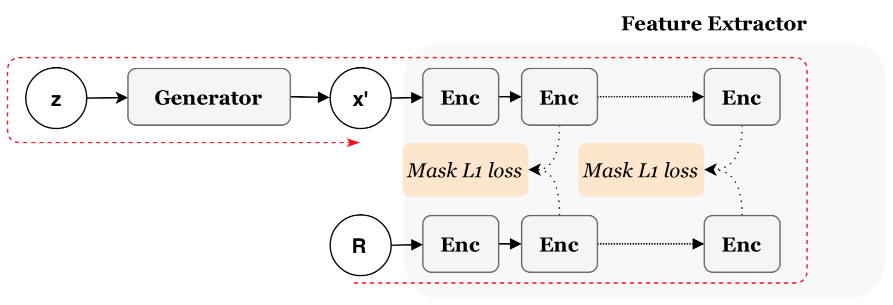
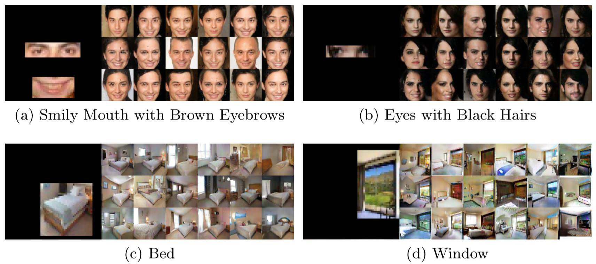

# [ACCV'18] Region-Semantics Preserving Image Synthesis
A TensorFlow implementation of PreservingGAN

[Project](https://tsujuifu.github.io/projs/accv18_preserving-gan.html) | [Paper](https://tsujuifu.github.io/pubs/accv18_preserving-gan.pdf) | [Youtube](https://youtu.be/UwBjSUpjZU8)



## Overview
PreservingGAN is an implementation of <br>
"[Region-Semantics Preserving Image Synthesis](https://tsujuifu.github.io/pubs/accv18_preserving-gan.pdf)" <br>
Kang-Jun Liu, [Tsu-Jui Fu](https://tsujuifu.github.io/), [Shan-Hung Wu](http://www.cs.nthu.edu.tw/~shwu/) <br>
in Asian Conference on Computer Vision (<b>ACCV</b>) 2018 <br>
 <br>
Given a <b>reference image and R</b>, the Fast-RSPer synthesis an image by <b>finding (using the gradient descent) an input variable z</b> for the generator such that, at a deep layer where neurons <b>capture the semantics of the reference R</b>, the feature extractor <b>maps the synthesized region to features similar</b> to those of the reference region. Since both the generator and feature extractor are pre-trained, the Fast-RSPer has <b>no dedicated training phase</b> and can generate images efficiently. <br>


## Requirements
This code is implemented under <b>Python3</b> and [TensorFlow](https://www.tensorflow.org/). <br>
Following libraries are also required: <br>
+ [TensorFlow](https://www.tensorflow.org/) >= 1.6
+ [PyQt5](https://pypi.org/project/PyQt5/)
+ [opencv-python](https://pypi.org/project/opencv-python/)
+ [matplotlib](https://matplotlib.org/)

## Usage
+ First download the model from [here](https://drive.google.com/drive/folders/1fc6SaSHAJuJIPRUkkNt-UjHe3OEf2ztS?usp=sharing) and put them under [Model](./Model)
+ GUI interface
```
python -m main_bedroom
```
+ ipython notebook
```
PreservingGAN_Bedroom.ipynb
```
[Here](./Dataset) are some example inputs.

## Resources
## Citation
## Acknowledgement

